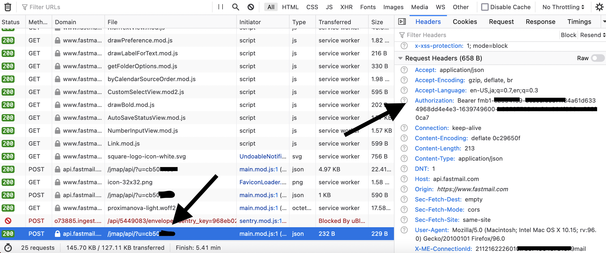

# Fastmail MaskedEmail CLI

Simple CLI to create Fastmail masked emails

## Setup

```
go install github.com/dvcrn/maskedemail-cli
```

### Authentication

1. Navigate to fastmail.com and login
2. Open the dev tools and search for a request to api.fastmail.com



3. Copy the authorization bearer header, this is your `token`
4. Copy the ?u=xxxxx part, prefix it with "u" this is your `accountID`. Eg. if the paramter is cb504155, your userid is ucb504155

## Usage

Currently only the `create` command is implemented

```
Usage of maskedemail-cli
Flags:
  -accountid string
        fastmail account id
  -appname string
        the appname to identify the creator (default "maskedemail-cli")
  -token string
        the token to authenticate with

Commands:
  maskedemail-cli create <domain>
```

Example:

```
maskedemail-cli -accountid xxxx -token abcdef12345 create facebook.com
```

## License

MIT
